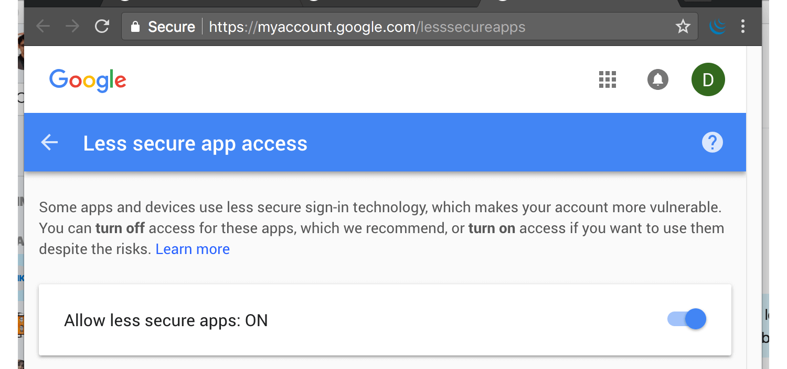
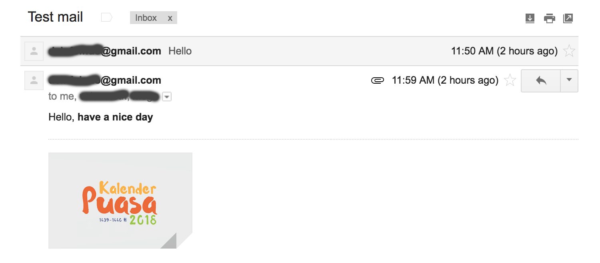

# C.18. Send Mail (`net/smtp`, Gomail v2)

Pada chapter ini kita akan belajar cara mengirim email dari aplikasi golang, menggunakan dua cara berikut.

 1. Dengan memanfaatkan package `net/smtp`.
 2. Menggunakan Library [gomail](https://gopkg.in/gomail.v2).

## C.18.1. Kirim Email Menggunakan `net/smtp`

Golang menyediakan package `net/smtp`, isinya banyak API untuk berkomunikasi via protokol SMTP. Lewat package ini kita bisa melakukan operasi kirim email.

Sebuah akun email diperlukan dalam mengirim email, silakan gunakan provider email apa saja. Pada chapter ini kita gunakan Google Mail (gmail), jadi siapkan satu buah akun gmail untuk keperluan testing.

Mari kita praktekan. Buat folder project baru, salin kode berikut.

```go
package main

import (
    "fmt"
    "log"
    "net/smtp"
    "strings"
)

const CONFIG_SMTP_HOST = "smtp.gmail.com"
const CONFIG_SMTP_PORT = 587
const CONFIG_SENDER_NAME = "PT. Makmur Subur Jaya <emailanda@gmail.com>"
const CONFIG_AUTH_EMAIL = "emailanda@gmail.com"
const CONFIG_AUTH_PASSWORD = "passwordemailanda"

func main() {
    to := []string{"recipient1@gmail.com", "emaillain@gmail.com"}
    cc := []string{"tralalala@gmail.com"}
    subject := "Test mail"
    message := "Hello"

    err := sendMail(to, cc, subject, message)
    if err != nil {
        log.Fatal(err.Error())
    }

    log.Println("Mail sent!")
}
```

Dalam implementasinya, untuk bisa mengirim email, dibutuhkan mail server. Karena kita menggunakan email google, maka mail server milik google digunakan.

Pada kode di atas, konstanta dengan prefix `CONFIG_` adalah konfigurasi yang diperlukan untuk terhubung dengan mail server. Isi dari kedua variabel `CONFIG_AUTH_EMAIL` dan `CONFIG_AUTH_PASSWORD` digunakan untuk keperluan otentikasi dengan SMTP server. Silakan sesuaikan dengan akun yang digunakan di masing-masing.

Di dalam fungsi main bisa dilihat, fungsi `sendMail()` dipanggil untuk mengirim email, dengan empat buah parameter disisipkan.

 - Parameter `to`, adalah tujuan email.
 - Parameter `cc`, adalah cc tujuan.
 - Parameter `subject`, adalah subjek email.
 - Parameter `message`, adalah body email.

Konstanta `CONFIG_SENDER_NAME` isinya dipergunakan sebagai label header pengirim email. Bisa di-isi dengan label apapun.

> Di sini `CONFIG_SENDER_NAME` perannya hanya sebagai label header pengirim email saja. Untuk email otentikasi dengan SMTP server sendiri yang dipergunakan adalah `CONFIG_AUTH_EMAIL`.

OK, selanjutnya buat fungsi `sendMail()` berikut.

```go
func sendMail(to []string, cc []string, subject, message string) error {
	body := "From: " + CONFIG_SENDER_NAME + "\n" +
		"To: " + strings.Join(to, ",") + "\n" +
		"Cc: " + strings.Join(cc, ",") + "\n" +
		"Subject: " + subject + "\n\n" +
		message

	auth := smtp.PlainAuth("", CONFIG_AUTH_EMAIL, CONFIG_AUTH_PASSWORD, CONFIG_SMTP_HOST)
	smtpAddr := fmt.Sprintf("%s:%d", CONFIG_SMTP_HOST, CONFIG_SMTP_PORT)

	err := smtp.SendMail(smtpAddr, auth, CONFIG_AUTH_EMAIL, append(to, cc...), []byte(body))
	if err != nil {
		return err
	}

	return nil
}
```

Fungsi `sendMail()` digunakan untuk mengirim email. Empat data yang disisipkan pada fungsi tersebut dijadikan satu dalam format tertentu, lalu disimpan ke variabel `body`. 

Statement yang ditampung oleh `body` akan menghasilkan string berikut (formatnya adalah baku).

```
From: PT. Makmur Subur Jaya <emailanda@gmail.com>
To: recipient1@gmail.com, emaillain@gmail.com
Cc: tralalala@gmail.com
Subject: Test mail

Hello
```

Pengiriman email dilakukan lewat `smtp.SendMail()`. Dalam pemanggilannya 5 buah parameter disisipkan, berikut adalah penjelasan masing-masing parameter.

 - Parameter ke-1, `smtpAddr`, merupakan kombinasi host dan port mail server.
 - Parameter ke-2, `auth`, menampung credentials untuk keperluan otentikasi ke mail server. Objek ini dicetak lewat `smtp.PlainAuth()`.
 - Parameter ke-3, `CONFIG_AUTH_EMAIL`, adalah alamat email yang digunakan untuk mengirim email.
 - Parameter ke-4, Isinya adalah semua email tujuan, termasuk `Cc`.
 - Parameter ke-5, isinya `body` email.

Jalankan aplikasi. Lihat di console, error muncul.


Error di atas hanya muncul pada pengiriman email menggunakan akun google mail. Untuk alasan keamanan, google men-disable akun gmail untuk digunakan mengirim email lewat kode program.

Aktifkan fasilitas **less secure apps** untuk meng-enable-nya. Login ke gmail masing-masing, kemudian buka link https://myaccount.google.com/lesssecureapps, lalu klik tombol toggle agar menjadi **OFF**.



Jalankan ulang aplikasi, email terkirim. Lihat di inbox email tujuan pengiriman untuk mengecek hasilnya.


## C.18.2. Kirim Email Menggunakan Gomail v2

Dengan library [gomail](https://gopkg.in/gomail.v2), pengiriman email bisa dilakukan dengan mudah. Beberapa operasi seperti membuat email dalam bentuk html, menambahkan attachment, menambahkan bcc, bisa dilakukan dengan mudah lewat gomail.

Mari langsung kita praktekan. Unduh terlebih dahulu library-nya.

```bash
go get -u gopkg.in/gomail.v2
```

Lalu tulis kode berikut.

```go
package main

import (
    "gopkg.in/gomail.v2"
    "log"
)

const CONFIG_SMTP_HOST = "smtp.gmail.com"
const CONFIG_SMTP_PORT = 587
const CONFIG_SENDER_NAME = "PT. Makmur Subur Jaya <emailanda@gmail.com>"
const CONFIG_AUTH_EMAIL = "emailanda@gmail.com"
const CONFIG_AUTH_PASSWORD = "passwordemailanda"

func main() {
	mailer := gomail.NewMessage()
	mailer.SetHeader("From", CONFIG_SENDER_NAME)
	mailer.SetHeader("To", "recipient1@gmail.com", "emaillain@gmail.com")
	mailer.SetAddressHeader("Cc", "tralalala@gmail.com", "Tra Lala La")
	mailer.SetHeader("Subject", "Test mail")
	mailer.SetBody("text/html", "Hello, <b>have a nice day</b>")
	mailer.Attach("./sample.png")

    dialer := gomail.NewDialer(
        CONFIG_SMTP_HOST,
        CONFIG_SMTP_PORT,
        CONFIG_AUTH_EMAIL,
        CONFIG_AUTH_PASSWORD,
    )

    err := dialer.DialAndSend(mailer)
    if err != nil {
        log.Fatal(err.Error())
    }

    log.Println("Mail sent!")
}
```

Siapkan satu buah image bernama `sample.png`, simpan di dalam folder yang sama dengan file main. Untuk meng-attach file ke dalam email, gunakan method `.Attach()` milik `*gomail.Message`.

Pada contoh kali ini email isinya adalah HTML. Gunakan MIME html pada parameter pertama `.SetBody()` untuk mengaktifkan mode html email.

Jalankan aplikasi, lalu cek hasilnya email yang dikirim di inbox.



## C.18.3. Kirim Email dengan Konfigurasi SMTP Relay / No Auth / Tanpa Otentikasi

Cara untuk mengirim email menggunakan konfigurasi SMTP relay atau *No Auth* sangatlah mudah lewat library gomail.v2.

Cukup lakukan sedikit modifikasi berikut pada kode yang sudah dibuat. Pada inisialisasi object `dialer` ubah statement-nya menjadi berikut:

```go
dialer := &gomail.Dialer{Host: CONFIG_SMTP_HOST, Port: CONFIG_SMTP_PORT}
```

Daaaaannnnn ... cukup itu saja penyesuaiannya agar bisa kirim email via konfigurasi SMTP relay :-)

---

 - [Gomail v2](https://gopkg.in/gomail.v2), by Alexandre Cesaro, MIT license

---

<div class="source-code-link">
    <div class="source-code-link-message">Source code praktik chapter ini tersedia di Github</div>
    <a href="https://github.com/novalagung/dasarpemrogramangolang-example/tree/master/chapter-C.18-send-email">https://github.com/novalagung/dasarpemrogramangolang-example/.../chapter-C.18...</a>
</div>

---

<iframe src="partial/ebooks.html" width="100%" height="390px" frameborder="0" scrolling="no"></iframe>
