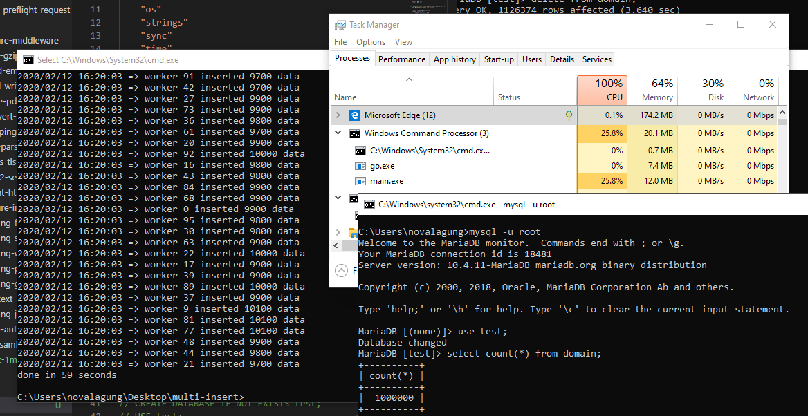

# D.1. Insert 1 Juta Rows CSV ke Database Secara Konkuren/Parallel

Pada chapter ini kita akan praktik penerapan salah satu teknik concurrent programming di Go yaitu worker pool, dikombinasikan dengan database connection pool, untuk membaca 1 juta rows data dari sebuah file CSV untuk kemudian di-insert-kan ke MySQL server.

Pada bagian insert data kita terapkan mekanisme failover, jadi ketika ada operasi insert gagal, maka akan otomatis di-recover dan di-retry. Idealnya di akhir, semua data sejumlah satu juta akan berhasil di-insert.

## D.1.1. Penjelasan

#### ◉ Worker Pool

Worker pool adalah teknik manajemen goroutine dalam concurrent programming pada Go. Sejumlah worker dijalankan dan masing-masing memiliki tugas yang sama yaitu menyelesaikan sejumlah jobs.

Dengan metode worker pool ini, penggunaan memory dan performa program bisa lebih optimal dibanding menjalankan satu goroutine per job (yang bisa mencapai 1 juta goroutine sekaligus).

#### ◉ Database Connection Pool

Connection pool adalah metode untuk manajemen sejumlah koneksi database agar bisa digunakan secara optimal.

Connection pool sangat penting dalam kasus operasi data yang berhubungan dengan database di mana concurrent programming diterapkan. Karena beberapa proses berjalan bersamaan, penggunaan 1 koneksi saja akan menghambat proses tersebut. Dengan beberapa koneksi dalam pool, goroutine tidak perlu rebutan satu objek koneksi.

Go mengelola connection pool secara otomatis lewat package `database/sql`. Kita cukup atur batas maksimum koneksi via `SetMaxOpenConns()` dan `SetMaxIdleConns()`.

#### ◉ Failover

Failover merupakan mekanisme backup ketika sebuah proses gagal. Pada konteks ini, failover mengarah ke proses untuk me-retry operasi insert ketika ada error, hingga insert berhasil.

## D.1.2. Persiapan

File [majestic-million-csv](https://blog.majestic.com/development/majestic-million-csv-daily/) digunakan sebagai bahan dalam praktik. File tersebut gratis dengan lisensi CCA3. Isinya adalah list dari top website berjumlah 1 juta.

Silakan download file-nya di sini: http://downloads.majestic.com/majestic_million.csv.

Setelah itu siapkan MySQL database server, buat database dan tabel `domain` di dalamnya.

```sql
CREATE DATABASE IF NOT EXISTS test;
USE test;
CREATE TABLE IF NOT EXISTS domain (
    GlobalRank int,
    TldRank int,
    Domain varchar(255),
    TLD varchar(255),
    RefSubNets int,
    RefIPs int,
    IDN_Domain varchar(255),
    IDN_TLD varchar(255),
    PrevGlobalRank int,
    PrevTldRank int,
    PrevRefSubNets int,
    PrevRefIPs int
);
```

Setelah itu buat project baru dengan satu file `main.go`, dan tempatkan file CSV yang sudah didownload dalam folder yang sama.

Karena contoh ini menggunakan MySQL, perlu install driver-nya terlebih dahulu.

```bash
go get -u github.com/go-sql-driver/mysql
```

## D.1.3. Praktik

#### ◉ Definisi Variabel

Ada beberapa variabel konfigurasi yang perlu dipersiapkan.

```go
var (
    dbConnString   = "root@/test"
    dbMaxIdleConns = 4
    dbMaxConns     = 100
    totalWorker    = 100
    csvFile        = "majestic_million.csv"
    dataHeaders    = []string{
        "GlobalRank", "TldRank", "Domain", "TLD",
        "RefSubNets", "RefIPs", "IDN_Domain", "IDN_TLD",
        "PrevGlobalRank", "PrevTldRank", "PrevRefSubNets", "PrevRefIPs",
    }
)
```

- `dbConnString` adalah connection string ke MySQL. Sesuaikan dengan konfigurasi lokal.
- `dbMaxIdleConns` adalah jumlah koneksi idle yang diizinkan dalam pool.
- `dbMaxConns` adalah jumlah maksimum koneksi aktif dalam pool.
- `totalWorker` adalah jumlah goroutine worker yang akan berjalan bersamaan.
- `csvFile` adalah nama file CSV yang berada satu folder dengan `main.go`.
- `dataHeaders` adalah nama kolom tabel, sesuai urutan kolom di CSV (setelah baris header dilewati).

#### ◉ Fungsi Buka Koneksi Database

```go
func openDbConnection() (*sql.DB, error) {
    log.Println("=> open db connection")

    db, err := sql.Open("mysql", dbConnString)
    if err != nil {
        return nil, err
    }

    db.SetMaxOpenConns(dbMaxConns)
    db.SetMaxIdleConns(dbMaxIdleConns)

    return db, nil
}
```

`sql.Open()` tidak langsung membuka koneksi, ia hanya memvalidasi argumen dan mempersiapkan pool. Koneksi aktual baru dibuka saat pertama kali digunakan. `SetMaxOpenConns()` dan `SetMaxIdleConns()` mengatur batas pool agar tidak membebani server database.

Jangan lupa import driver-nya secara blank import agar side effect registrasinya berjalan.

```go
import _ "github.com/go-sql-driver/mysql"
```

#### ◉ Fungsi Baca CSV

```go
func openCsvFile() (*csv.Reader, *os.File, error) {
    log.Println("=> open csv file")

    f, err := os.Open(csvFile)
    if err != nil {
        if os.IsNotExist(err) {
            log.Fatal("file majestic_million.csv tidak ditemukan. silakan download terlebih dahulu di https://blog.majestic.com/development/majestic-million-csv-daily")
        }
        return nil, nil, err
    }

    reader := csv.NewReader(f)
    return reader, f, nil
}
```

Fungsi ini membuka file CSV dan mengembalikan objek `*csv.Reader` untuk dibaca baris per baris, plus objek `*os.File` agar bisa di-close oleh pemanggil. Pengecekan `os.IsNotExist()` memberikan pesan error yang lebih informatif jika file belum didownload.

#### ◉ Fungsi Menjalankan Workers

```go
func dispatchWorkers(db *sql.DB, jobs <-chan []interface{}, wg *sync.WaitGroup) {
    for workerIndex := 0; workerIndex < totalWorker; workerIndex++ {
        go func(workerIndex int, db *sql.DB, jobs <-chan []interface{}, wg *sync.WaitGroup) {
            counter := 0

            for job := range jobs {
                doTheJob(workerIndex, counter, db, job)
                wg.Done()
                counter++
            }
        }(workerIndex, db, jobs, wg)
    }
}
```

Fungsi ini men-dispatch sejumlah `totalWorker` goroutine. Setiap goroutine adalah satu worker yang terus memantau channel `jobs`. Saat ada data masuk, worker mengambil dan memprosesnya lewat `doTheJob()`. Setelah selesai, `wg.Done()` dipanggil untuk menandai satu job selesai.

Perlu diperhatikan bahwa `workerIndex` dijadikan argumen goroutine, bukan di-capture langsung dari loop. Ini penting agar tiap goroutine mendapat nilai `workerIndex` yang tepat, bukan nilai terakhir dari perulangan.

#### ◉ Fungsi Baca CSV dan Pengiriman Jobs ke Worker

Proses membaca file CSV bersifat sekuensial, baris demi baris dari atas ke bawah. Ini memang tidak bisa di-konkurensikan, karena `csv.Reader` membaca stream secara berurutan.

```go
func readCsvFilePerLineThenSendToWorker(csvReader *csv.Reader, jobs chan<- []interface{}, wg *sync.WaitGroup) {
    isHeader := true
    for {
        row, err := csvReader.Read()
        if err != nil {
            if err == io.EOF {
                err = nil
            }
            break
        }

        if isHeader {
            isHeader = false
            continue
        }

        rowOrdered := make([]interface{}, 0)
        for _, each := range row {
            rowOrdered = append(rowOrdered, each)
        }

        wg.Add(1)
        jobs <- rowOrdered
    }
    close(jobs)
}
```

Baris pertama CSV adalah header, dilewati dengan flag `isHeader`. Baris selanjutnya dikonversi ke `[]interface{}` dan dikirim ke channel `jobs`. Setiap pengiriman dibarengi `wg.Add(1)` agar WaitGroup tahu ada satu job baru yang harus ditunggu.

Setelah semua baris terbaca (loop selesai), channel `jobs` di-close. Penutupan ini yang menyebabkan semua worker keluar dari `for job := range jobs` setelah job terakhir selesai diproses.

#### ◉ Fungsi Insert Data ke Database

```go
func doTheJob(workerIndex, counter int, db *sql.DB, values []interface{}) {
    for {
        var outerError error
        func(outerError *error) {
            defer func() {
                if err := recover(); err != nil {
                    *outerError = fmt.Errorf("%v", err)
                }
            }()

            conn, err := db.Conn(context.Background())
            if err != nil {
                *outerError = err
                return
            }
            defer conn.Close()

            query := fmt.Sprintf("INSERT INTO domain (%s) VALUES (%s)",
                strings.Join(dataHeaders, ","),
                strings.Join(generateQuestionsMark(len(dataHeaders)), ","),
            )

            _, err = conn.ExecContext(context.Background(), query, values...)
            if err != nil {
                *outerError = err
                return
            }
        }(&outerError)
        if outerError == nil {
            break
        }
        log.Println("=> retrying insert, error:", outerError)
    }

    if counter%100 == 0 {
        log.Println("=> worker", workerIndex, "inserted", counter, "data")
    }
}

func generateQuestionsMark(n int) []string {
    s := make([]string, 0)
    for i := 0; i < n; i++ {
        s = append(s, "?")
    }
    return s
}
```

Beberapa hal penting dalam fungsi ini:

- Keseluruhan operasi insert dibungkus dalam IIFE (immediately invoked function expression) di dalam perulangan `for`. Ini adalah implementasi mekanisme failover: jika insert gagal (`outerError != nil`), perulangan lanjut dan operasi diulang.
- `defer func() { recover() }()` menangkap panic yang mungkin terjadi dari dalam IIFE dan mengonversinya ke error biasa, agar bisa ditangani oleh mekanisme retry.
- `db.Conn()` mengambil satu koneksi dari pool. Error dari pemanggilan ini perlu dicek, karena jika pool penuh dan semua koneksi sedang dipakai, pemanggilan ini bisa gagal.
- `defer conn.Close()` mengembalikan koneksi ke pool setelah IIFE selesai, baik sukses maupun gagal.
- Query dibentuk secara dinamis menggunakan `dataHeaders` dan placeholder `?` sejumlah kolom. Penggunaan placeholder (parameterized query) ini penting untuk menghindari SQL injection.

> **Catatan:** Mekanisme retry di atas tidak memiliki batas percobaan dan tidak ada jeda antar retry. Jika database tidak dapat diakses dalam waktu lama, goroutine akan terus looping tanpa henti. Untuk kebutuhan produksi, tambahkan batas maksimum retry dan exponential backoff.

#### ◉ Fungsi Main

```go
func main() {
    start := time.Now()

    db, err := openDbConnection()
    if err != nil {
        log.Fatal(err.Error())
    }

    csvReader, csvFile, err := openCsvFile()
    if err != nil {
        log.Fatal(err.Error())
    }
    defer csvFile.Close()

    jobs := make(chan []interface{}, 0)
    wg := new(sync.WaitGroup)

    go dispatchWorkers(db, jobs, wg)
    readCsvFilePerLineThenSendToWorker(csvReader, jobs, wg)

    wg.Wait()

    duration := time.Since(start)
    fmt.Println("done in", int(math.Ceil(duration.Seconds())), "seconds")
}
```

Alur eksekusinya adalah:

1. Buka koneksi database.
2. Buka file CSV.
3. Buat channel `jobs` dan WaitGroup.
4. `dispatchWorkers()` dijalankan sebagai goroutine agar langsung siap menunggu jobs.
5. `readCsvFilePerLineThenSendToWorker()` dijalankan di goroutine utama (blocking): membaca CSV baris demi baris dan mengirim ke `jobs`.
6. `wg.Wait()` menunggu seluruh 1 juta insert selesai sebelum program berhenti.

> Channel `jobs` di sini dibuat tanpa buffer (`make(chan []interface{}, 0)`). Artinya setiap pengiriman baris CSV akan memblokir sampai ada worker yang mengambilnya. Jika ingin mengurangi kemungkinan reader memblokir terlalu lama, bisa gunakan buffered channel, misalnya `make(chan []interface{}, 500)`.

## D.1.4. Eksekusi Program

Setelah semua siap, jalankan program-nya.



Bisa dilihat operasi insert selesai dalam waktu sekitar 1 menit. Pengujian dilakukan pada laptop dengan spesifikasi berikut:

- Core i7-8750H 2.20GHz (6 core, 12 logical processor)
- RAM 16GB
- SSD

Utilisasi CPU hanya 25.8% dan RAM hanya 12MB untuk sisi program Go-nya. CPU usage di Task Manager mencapai 100% karena MySQL server lokal yang bekerja keras melayani 100 koneksi insert secara bersamaan.

Sebagai perbandingan, operasi insert yang sama secara sekuensial (tanpa worker pool dan tanpa connection pool) memakan waktu hingga **20 menit**. Perbedaan performa ini menunjukkan betapa signifikannya penerapan konkurensi untuk kasus seperti ini.

> Praktik pada chapter ini bersifat POC (Proof of Concept). Untuk kebutuhan produksi, pertimbangkan batched insert (insert beberapa baris dalam satu query), mekanisme retry dengan backoff, serta monitoring terhadap jumlah koneksi database yang aktif.

---

 - [go-sql-driver/mysql](https://github.com/go-sql-driver/mysql), by Go SQL Driver Team, Mozilla Public License 2.0

---

<div class="source-code-link">
    <div class="source-code-link-message">Source code praktik chapter ini tersedia di Github</div>
    <a href="https://github.com/novalagung/dasarpemrogramangolang-example/tree/master/chapter-D.1-insert-1mil-csv-record-into-db-in-a-minute">https://github.com/novalagung/dasarpemrogramangolang-example/...</a>
</div>

---

<iframe src="partial/ebooks.html" width="100%" height="390px" frameborder="0" scrolling="no"></iframe>
